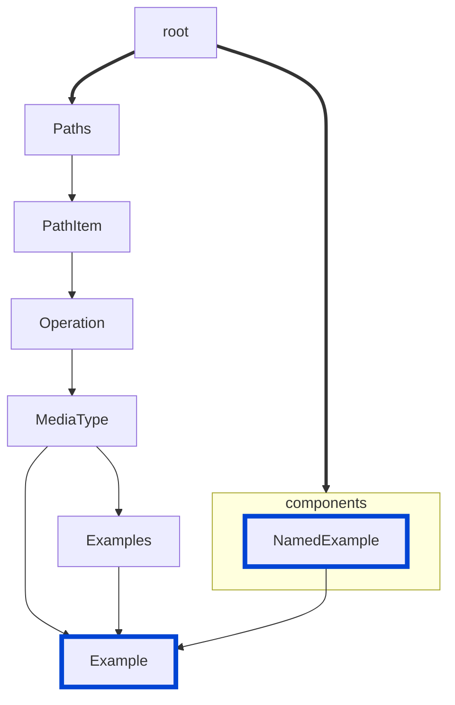

# no-invalid-media-type-examples

Disallow invalid media type examples by ensuring they comply with the corresponding schema definitions.

|OAS|Compatibility|
|---|---|
|2.0|❌|
|3.0|✅|
|3.1|✅|



## API design principles

"Got examples?" (One of the great advertising campaigns of the 1990s... or was that **got milk?**)

In any case, those examples should be valid if someone tries them out.
However, what are the odds they are valid if they clash with the schema defined? Very little.
Most likely there is either a mistake with the example or the schema (or both).

Trust us.
It's much nicer to get this alert from Redocly before you ship than from your biggest customer three months later.
## Configuration

|Option|Type| Description                                                                   |
|---|---|-------------------------------------------------------------------------------|
|severity|string| Possible values: `off`, `warn`, `error`. Default `warn`.                      |
|allowAdditionalProperties|boolean| Determines if additional properties are allowed in examples. Default `false`. |

An example configuration:

```yaml
rules:
  no-invalid-media-type-examples:
    severity: error
    allowAdditionalProperties: false
```

## Examples

Given this configuration:

```yaml
rules:
  no-invalid-media-type-examples:
    severity: error
    allowAdditionalProperties: false
```

Example of an **incorrect** media type example:

```yaml
post:
  requestBody:
    content:
      application/json:
        schema:
          type: object
          properties:
            make:
              type: string
            model:
              type: string
            year:
              type: integer
        examples:
          tesla:
            summary: Red Tesla
            value:
              make: Tesla
              model: Y
              year: '2022'
```
> This example produces an error because the year is a string instead of an integer.


Example of a **correct** media type example:

```yaml
post:
  requestBody:
    content:
      application/json:
        schema:
          type: object
          properties:
            make:
              type: string
            model:
              type: string
            year:
              type: integer
        examples:
          tesla:
            summary: Red Tesla
            value:
              make: Tesla
              model: Y
              year: 2022
```

Example of **incorrect** media type example due to additional property:

```yaml
post:
  requestBody:
    content:
      application/json:
        schema:
          type: object
          properties:
            make:
              type: string
            model:
              type: string
            year:
              type: integer
        examples:
          tesla:
            summary: Red Tesla
            value:
              make: Tesla
              model: Y
              year: 2022
              color: red
```

## Related rules

- [no-invalid-parameter-examples](./no-invalid-parameter-examples.md)
- [no-invalid-schema-examples](./no-invalid-schema-examples.md)
- [no-enum-type-mismatch](./no-enum-type-mismatch.md)

## Resources

- [Rule source](https://github.com/Redocly/redocly-cli/blob/main/packages/core/src/rules/oas3/no-invalid-media-type-examples.ts)
- [Example docs](https://redocly.com/docs/openapi-visual-reference/example/)
- [Media type object docs](https://redocly.com/docs/openapi-visual-reference/media-type/)
