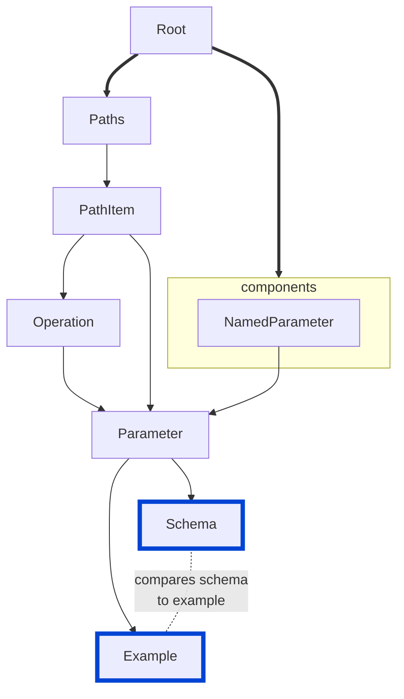

# no-invalid-parameter-examples

Disallow invalid parameter examples.

|OAS|Compatibility|
|---|---|
|2.0|✅|
|3.0|✅|
|3.1|✅|



## API design principles

If your parameter schema and example conflict, there is a problem in the definition of the schema or the example.
Solve it before you ship it.

## Configuration

|Option|Type| Description                                                                   |
|---|---|-------------------------------------------------------------------------------|
|severity|string| Possible values: `off`, `warn`, `error`. Default `warn`.                      |
|allowAdditionalProperties|boolean| Determines if additional properties are allowed in examples. Default `false`. |

```yaml
rules:
  no-invalid-parameter-examples:
    severity: error
    allowAdditionalProperties: false
```

## Examples

Given the following configuration:

```yaml
rules:
  no-invalid-parameter-examples:
    severity: error
    allowAdditionalProperties: false
```

Example of **incorrect** parameter example:

```yaml
paths:
  /results:
    get:
      summary: Search Chess Results
      operationId: searchChessResult
      parameters:
        - name: username
          in: query
          schema:
            type: string
            maxLength: 15
          description: Value to query the chess results against usernames
          example: ThisUsernameIsTooLong
```

Example of **correct** parameter example:

```yaml
paths:
  /results:
    get:
      summary: Search Chess Results
      operationId: searchChessResult
      parameters:
        - name: username
          in: query
          schema:
            type: string
            maxLength: 10
          description: Value to query the chess results against usernames
          example: ella
```

## Related rules

- [no-invalid-media-type-examples](./no-invalid-media-type-examples.md)
- [no-invalid-schema-examples](./no-invalid-schema-examples.md)

## Resources

- [Rule source](https://github.com/Redocly/redocly-cli/blob/main/packages/core/src/rules/common/no-invalid-parameter-examples.ts)
- [OpenAPI Parameter docs](https://redocly.com/docs/openapi-visual-reference/parameter/)
