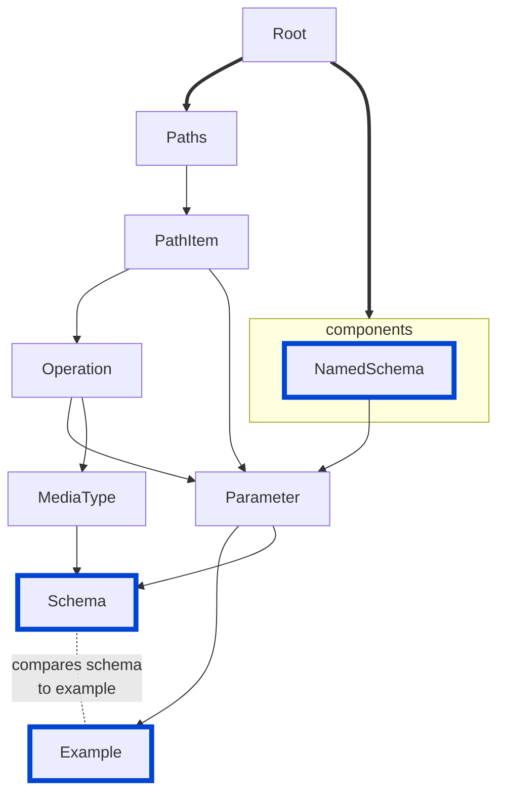

# no-invalid-schema-examples

Disallow invalid schema examples.

|OAS|Compatibility|
|---|---|
|2.0|✅|
|3.0|✅|
|3.1|✅|


## API design principles

If your schema and example conflict, there is a problem in the definition of the schema or the example.
Solve it before you ship it.

## Configuration

|Option|Type| Description                                                                   |
|---|---|-------------------------------------------------------------------------------|
|severity|string| Possible values: `off`, `warn`, `error`. Default `warn`.                      |
|allowAdditionalProperties|boolean| Determines if additional properties are allowed in examples. Default `false`. |

An example configuration:

```yaml
rules:
  no-invalid-schema-examples:
    severity: error
    allowAdditionalProperties: false
```

## Examples

Given the following configuration:

```yaml
rules:
  no-invalid-schema-examples:
    severity: error
    allowAdditionalProperties: false
```

Example of **incorrect** schema example:

```yaml
components:
  schemas:
    Car:
      type: object
      properties:
        color:
          type: string
          example: 3.14
```

Example of **correct** parameter example:

```yaml
components:
  schemas:
    Car:
      type: object
      properties:
        color:
          type: string
          example: red
```

## Related rules

- [no-invalid-media-type-examples](./no-invalid-media-type-examples.md)
- [no-invalid-parameter-examples](./no-invalid-parameter-examples.md)

## Resources

- [Rule source](https://github.com/Redocly/redocly-cli/blob/main/packages/core/src/rules/common/no-invalid-schema-examples.ts)
- [Schema docs](https://redocly.com/docs/openapi-visual-reference/schemas/)
