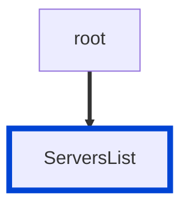

# no-server-example.com

Prevents using `example.com` as the value of the `servers.url` fields in your API definitions.
The rule checks for all URL schemes (`http`, `https`...).

|OAS|Compatibility|
|---|---|
|2.0|❌|
|3.0|✅|
|3.1|✅|




## API design principles

Although commonly used in different kinds of documentation, `example.com` is not a real API server.
Your consumers cannot use it to test your APIs.
Be helpful - give them something they can use.

If you can't reveal a production server, consider a [Redocly mock server](/docs/api-registry/guides/mock-server-quickstart.md) instead.

## Configuration

|Option|Type|Description|
|---|---|---|
|severity|string|Possible values: `off`, `warn`, `error`. Default `warn` (in `recommended` configuration). |

An example configuration:

```yaml
rules:
  no-server-example.com: error
```

## Examples

Given this configuration:

```yaml
rules:
  no-server-example.com: error
```

Example of **incorrect** server:

```yaml
servers:
  - url: https://example.com
    description: Example server
```

Example of **correct** server:

```yaml Good example
servers:
  - url: https://swift-squirrel.remockly.com
    description: Mock server
```

## Related rules

- [no-empty-servers](./no-empty-servers.md)
- [no-server-trailing-slash](./no-server-trailing-slash.md)


## Resources

- [Rule source](https://github.com/Redocly/redocly-cli/blob/main/packages/core/src/rules/oas3/no-server-example.com.ts)
- [Servers list docs](https://redocly.com/docs/openapi-visual-reference/servers/)
