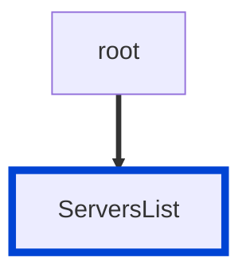

# no-server-trailing-slash

Disallow servers with a trailing slash.

|OAS|Compatibility|
|---|---|
|2.0|❌|
|3.0|✅|
|3.1|✅|




## API design principles

The endpoint URL is the server URL joined with the path.
The path must start with a slash.
If the server ends with a slash, there are double slashes.
You can get awkward URLs like `https://example.com/api//pets`.

This rule helps prevent such issues.
Servers should not end with a trailing slash.
Hands-down a good rule for every API designer.

## Configuration

|Option|Type|Description|
|---|---|---|
|severity|string|Possible values: `off`, `warn`, `error`. Default `error` (in `recommended` configuration). |

An example configuration:

```yaml
rules:
  no-server-trailing-slash: error
```

## Examples

Given this configuration:

```yaml
rules:
  no-server-trailing-slash: error
```

Example of **incorrect** server:

```yaml
servers:
  - url: https://swift-squirrel.remockly.com/
    description: Mock server
```

Example of **correct** server:

```yaml Good example
servers:
  - url: https://swift-squirrel.remockly.com
    description: Mock server
```

## Related rules

- [no-empty-servers](./no-empty-servers.md)
- [no-server-example-com](./no-server-example-com.md)

## Resources

- [Rule source](https://github.com/Redocly/redocly-cli/blob/main/packages/core/src/rules/oas3/no-server-trailing-slash.ts)
- [Servers list docs](https://redocly.com/docs/openapi-visual-reference/servers/)
