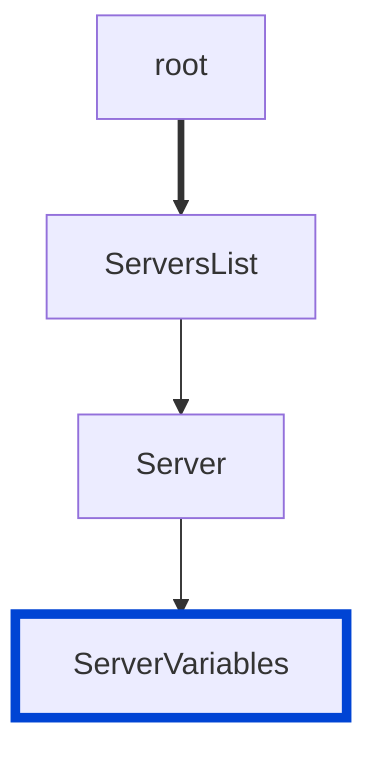

---
redirectFrom:
  - /docs/cli/rules/no-empty-enum-servers/
---
# no-server-variables-empty-enum

Disallow server variables without enum list defined.

|OAS|Compatibility|
|---|---|
|2.0|❌|
|3.0|✅|
|3.1|✅|




## API design principles

If you use server variables, there are generally two kinds:
- tenant-driven
- environment-driven

In the case of environment-driven variables, you may want to predefine all of the possible values.

## Configuration

|Option|Type|Description|
|---|---|---|
|severity|string|Possible values: `off`, `warn`, `error`. Default `error` (in `recommended` configuration). |

An example configuration:

```yaml
rules:
  no-server-variables-empty-enum: error
```

## Examples

Given this configuration:

```yaml
rules:
  no-server-variables-empty-enum: error
```

Example of **incorrect** server variables:

```yaml
servers:
  - url: 'https://{env}.example.com/api/v1'
    variables:
      env:
        default: api
        description: Environment
```

Example of **correct** server:

```yaml
servers:
  - url: 'https://{env}.example.com/api/v1'
    variables:
      env:
        default: api
        description: Environment
        enum:
          - api
          - sandbox
          - qa
          - test
          - dev
```

## Related rules

- [no-empty-servers](./no-empty-servers.md)
- [no-server-example.com](./no-server-example-com.md)
- [no-undefined-server-variable](./no-undefined-server-variable.md)

## Resources

- [Rule source](https://github.com/Redocly/redocly-cli/blob/main/packages/core/src/rules/oas3/no-server-variables-empty-enum.ts)
- [Servers list docs](https://redocly.com/docs/openapi-visual-reference/servers/)
