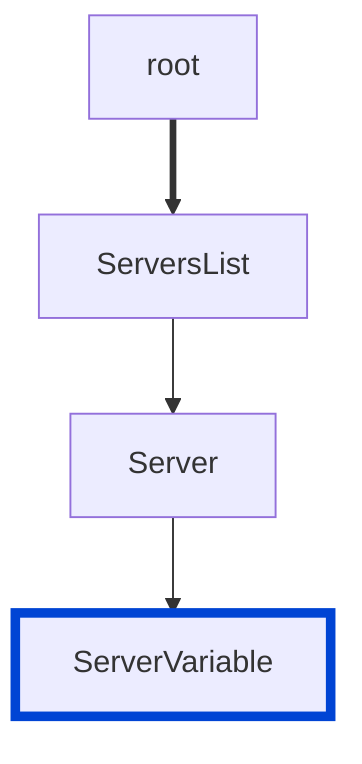

# no-undefined-server-variable

Disallow undefined server variables.

|OAS|Compatibility|
|---|---|
|2.0|❌|
|3.0|✅|
|3.1|✅|




## API design principles

If a variable is declared but not defined, it's an error with the specification.

It is important to fix these errors to help clients consume APIs.

## Configuration

|Option|Type|Description|
|---|---|---|
|severity|string|Possible values: `off`, `warn`, `error`. Default `error` (in `recommended` configuration). |

An example configuration:

```yaml
rules:
  no-undefined-server-variable: error
```

## Examples

Given this configuration:

```yaml
rules:
  no-undefined-server-variable: error
```

Example of **incorrect** server variables:

```yaml
servers:
  - url: 'https://{tenant}/api/v1'
```

Example of **correct** server variables:

```yaml
servers:
  - url: 'https://{tenant}/api/v1'
    variables:
      tenant:
        default: api.example.com
        description: Your server host
```

## Related rules

- [no-empty-servers](./no-empty-servers.md)
- [no-server-example.com](./no-server-example-com.md)
- [no-server-variables-empty-enum](./no-server-variables-empty-enum.md)

## Resources

- [Rule source](https://github.com/Redocly/redocly-cli/blob/main/packages/core/src/rules/oas3/no-undefined-server-variable.ts)
- [Server variable docs](https://redocly.com/docs/openapi-visual-reference/server-variables/)
