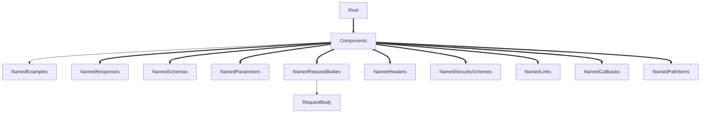

# spec-components-invalid-map-name

Requires that specific objects inside `components` MUST use keys that match the regular expression: `^[a-zA-Z0-9\.\-_]+$`.

|OAS|Compatibility|
|---|---|
|2.0|❌|
|3.0|✅|
|3.1|✅|



## API design principles

This rule is for spec correctness.

All the fixed fields declared below are objects that MUST use keys that match the regular expression: `^[a-zA-Z0-9\.\-_]+$`.

- schemas
- responses
- parameters
- examples
- requestBodies
- headers
- securitySchemes
- links
- callbacks
- pathItems

## Configuration

|Option|Type| Description                                                                                |
|---|---|--------------------------------------------------------------------------------------------|
|severity|string| Possible values: `off`, `warn`, `error`. Default `error` (in `recommended` configuration). |

An example configuration:

```yaml
rules:
  spec-components-invalid-map-name: error
```

## Examples

Given this configuration:

```yaml
rules:
  spec-components-invalid-map-name: error
```

Example of **incorrect** operation response:
```yaml
components:
  examples:
    invalid identifier:
      description: invalid identifier
      value: 21     
```

Example of **correct** operation response:

```yaml
components:
  examples:
    valid_identifier:
      description: valid identifier
      value: 21 
```

## Related rules

- [custom rules](./custom-rules.md)
- [spec](./spec.md)

## Resources

- [Rule source](https://github.com/Redocly/redocly-cli/blob/main/packages/core/src/rules/oas3/spec-components-invalid-map-name.ts)
- [Components docs](https://redocly.com/docs/openapi-visual-reference/components/)
