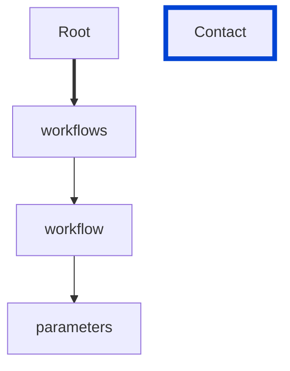
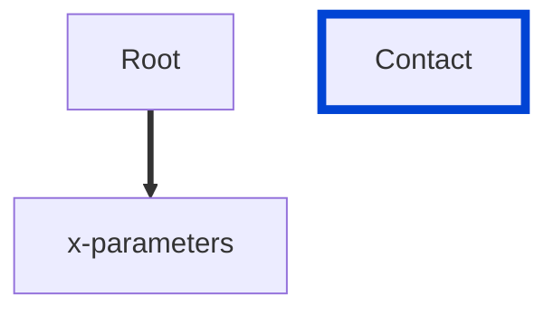
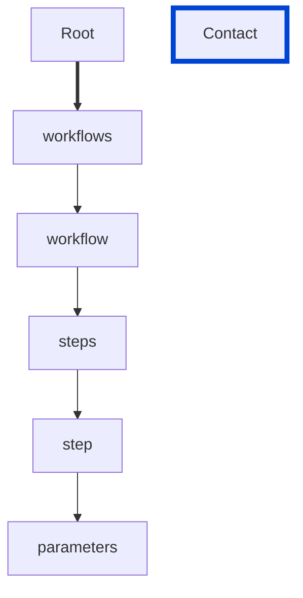

# parameters-not-in-body

Requires the `in` section inside `parameters` must not contain a `body`.

| ARAZZO | Compatibility |
|--------| ------------- |
| 1.0.0  | ✅            |







## API design principles

This is `Spot` specific rule.
`body` is not supported in the `in` section inside `parameters`.

## Configuration

| Option   | Type   | Description                                             |
| -------- | ------ | ------------------------------------------------------- |
| severity | string | Possible values: `off`, `warn`, `error`. Default `off`. |

An example configuration:

```yaml
arazzoRules:
  parameters-not-in-body: error
```

## Examples

Given the following configuration:

```yaml
arazzoRules:
  parameters-not-in-body: error
```

Example of an **incorrect** license:

```yaml Object example
workflows:
  - workflowId: get-museum-hours
    parameters:
      - in: body
        name: Authorization
        value: Basic Og==
```

Example of a **correct** license:

```yaml Object example
workflows:
  - workflowId: get-museum-hours
    parameters:
      - in: header
        name: Authorization
        value: Basic Og==
```

## Related rules

- [version-enum](./version-enum.md)

## Resources

- [Rule source](https://github.com/Redocly/redocly-cli/blob/main/packages/core/src/rules/spot/parameters-not-in-body.ts)
