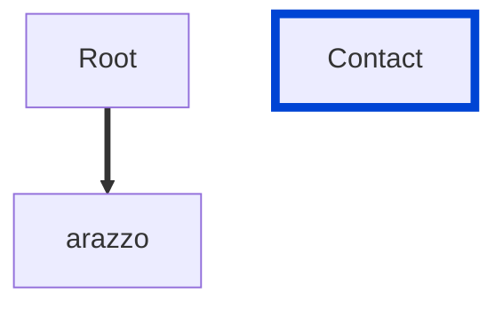

# version-enum

Requires the `version` property must be one of the supported values.

| ARAZZO | Compatibility |
|--------| ------------- |
| 1.0.0  | ✅            |



## API design principles

This is `Spot` specific rule.
The `version` property must be one of the supported values witch is might be different to the `Arazzo` latest versions. 

## Configuration

| Option   | Type   | Description                                             |
| -------- | ------ | ------------------------------------------------------- |
| severity | string | Possible values: `off`, `warn`, `error`. Default `off`. |

An example configuration:

```yaml
arazzoRules:
  version-enum: error
```

## Examples

Given the following configuration:

```yaml
arazzoRules:
  version-enum: error
```

Example of an **incorrect** license:

```yaml Object example
arazzo: 1.0.1
```

Example of a **correct** license:

```yaml Object example
arazzo: 1.0.0
```

## Related rules

- [parameters-not-in-body](./parameters-not-in-body.md)

## Resources

- [Rule source](https://github.com/Redocly/redocly-cli/blob/main/packages/core/src/rules/spot/version-enum.ts)

