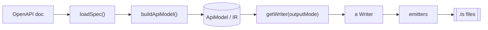

# Client Generator — Architecture

How `@redocly/client-generator` is built.
This is a **descriptive** map of the current shape — the pipeline, the modules, and the seams.
It says _what is_; the **why** (the significant decisions and their trade-offs) lives in the Architecture Decision Records under [`docs/adr/`](./docs/adr/), linked inline below.
For the vocabulary used here (IR, emitter, writer, runtime, facade, output mode, …), see [CONTEXT.md](./CONTEXT.md).
This is not a roadmap; planned refactors live in their own specs.

## Overview

The package turns an OpenAPI description into a typed TypeScript client with **zero runtime dependencies** — the generated code uses only web-standard APIs (`fetch`, `AbortController`, `URLSearchParams`), so it runs in browsers, Node, Bun, Deno, and edge runtimes (see [ADR-0002](./docs/adr/0002-typescript-peer-dep.md)).
It backs the `redocly generate-client` CLI command.

## Codegen approach

Generated TypeScript is built as a **TypeScript AST** (`ts.factory` nodes) and emitted by the compiler's own printer (`ts.createPrinter`), **not** by string interpolation — rationale and trade-offs in [ADR-0001](./docs/adr/0001-ast-codegen.md).
The one generation-time dependency is `typescript` itself, declared as a **peer** ([ADR-0002](./docs/adr/0002-typescript-peer-dep.md)); it is never emitted, so the generated client stays dependency-free.

A foundation module (`emitters/ts.ts`) wraps the ergonomics: re-exports `ts` (the `factory`), `printNodes(nodes)` over a shared printer, `parseStatements(source)` to embed hand-authored constant code (the **runtime**) as parsed nodes routed through the same printer, and `jsdoc(node, text)`.
Each emitter produces `ts.Statement[]` / `ts.TypeNode`s; the composition (`client.ts`) assembles the per-file statement list and prints **once**.
Formatting is the printer's; a pretty-print pass is deferred to optional-formatter work (roadmap P7.3).

## Pipeline

1. **`loadSpec`** (`loader.ts`) — bundles the OpenAPI document via `@redocly/openapi-core`, resolving external `$ref`s while **preserving internal `$ref`s** (the IR builder relies on named references staying intact).
   Also detects the spec version (`detectSpec`).
   1.5. **`normalizeSwagger2`** (`ir/normalize-swagger2.ts`) — when the detected version is `oas2`, converts the Swagger 2.0 document to the OpenAPI 3.x shape (definitions → components.schemas, host/basePath/schemes → servers, body/formData params → requestBody, `responses[].schema` → `responses[].content`, securityDefinitions → securitySchemes, `$ref` rewrite).
   OAS 3.0/3.1/3.2 skip this step.
2. **`buildApiModel`** (`ir/build.ts`) — walks the OpenAPI document and produces the spec-agnostic **IR** (`ir/model.ts`).
   Everything downstream reads the IR, never the raw spec ([ADR-0003](./docs/adr/0003-spec-agnostic-ir.md)).
3. **`getWriter(outputMode)`** (`writers/index.ts`) — selects the **Writer** for the chosen output mode.
4. The **Writer** decides the file layout and fills each file by calling the **emitters**.
5. The **emitters** (`emitters/`) build a **TypeScript AST** and print it via `emitters/ts.ts`.
6. `generateClient` (`index.ts`) writes the files to disk.

## Module map

| Area       | Files                                                                                                                                                                                                                                                                                                                                                                                                                       | Owns                                                                                                                                                                                                                                                                                                                                                                                                                                                                         | Depth                                                                                                                                                                         |
| ---------- | --------------------------------------------------------------------------------------------------------------------------------------------------------------------------------------------------------------------------------------------------------------------------------------------------------------------------------------------------------------------------------------------------------------------------- | ---------------------------------------------------------------------------------------------------------------------------------------------------------------------------------------------------------------------------------------------------------------------------------------------------------------------------------------------------------------------------------------------------------------------------------------------------------------------------- | ----------------------------------------------------------------------------------------------------------------------------------------------------------------------------- |
| Entry      | `index.ts`, `types.ts`, `config.ts`, `config-file.ts`, `plugin.ts`                                                                                                                                                                                                                                                                                                                                                          | `generateClient` orchestration; public option/result types; config loading; the experimental `@redocly/client-generator/plugin` entry (`defineGenerator` + IR types + codegen toolkit)                                                                                                                                                                                                                                                                                       | thin orchestrator                                                                                                                                                             |
| Load       | `loader.ts`                                                                                                                                                                                                                                                                                                                                                                                                                 | bundle + `$ref` resolution, preserving internal refs                                                                                                                                                                                                                                                                                                                                                                                                                         | deep (hides `openapi-core`)                                                                                                                                                   |
| IR         | `ir/build.ts`, `ir/model.ts`, `ir/refs.ts`, `ir/normalize-swagger2.ts`, `ir/sanitize-identifiers.ts`                                                                                                                                                                                                                                                                                                                        | OpenAPI → IR; the IR type model; ref collection; Swagger 2.0 → 3.x normalization; coerce document-derived names to safe unique identifiers (security boundary)                                                                                                                                                                                                                                                                                                               | deep (`buildApiModel` + `normalizeSwagger2` each one interface over a whole walk)                                                                                             |
| Writers    | `writers/index.ts`, `single-file-writer.ts`, `split-writer.ts`, `tagged.ts`, `tags-writer.ts`, `tags-split-writer.ts`, `group-by-tag.ts`, `util.ts`, `types.ts`                                                                                                                                                                                                                                                             | file layout per output mode                                                                                                                                                                                                                                                                                                                                                                                                                                                  | thin adapters at the `getWriter` seam + `group-by-tag` (deep)                                                                                                                 |
| Generators | `generators/index.ts` (registry + `validateGenerators`), `resolve.ts` (built-in / inline / specifier resolution), `types.ts`, `sdk.ts`, `zod.ts`, `tanstack-query.ts`, `swr.ts`, `transformers.ts`, `mock.ts`                                                                                                                                                                                                               | the generator registry seam: each descriptor declares its requires/facades/errorModes and produces `GeneratedFile[]` by calling an emitter; `resolve.ts` turns a selection (built-in names, inline `customGenerators`, or plugin import specifiers) into a name→descriptor registry                                                                                                                                                                                          | thin adapters at the `getGenerator` seam ([ADR-0004](./docs/adr/0004-registry-seams.md), [ADR-0012](./docs/adr/0012-plugin-api.md))                                           |
| Emitters   | sdk: `emitters/client.ts` (composition), `types.ts`, `type-guards.ts`, `auth.ts`, `operations.ts` (+ `operation-aliases.ts`, `operation-types.ts`), `sse.ts`, `runtime.ts`; satellite: `zod.ts`, `transformers.ts`, `tanstack-query.ts`, `swr.ts` (+ shared `wrapper-support.ts`), `mock.ts`/`faker.ts`/`sample.ts`; foundation `ts.ts`; shared `operation-signature.ts`; private `support.ts`, `jsdoc.ts`, `identifier.ts` | IR → TypeScript AST (`ts.factory` nodes, printed via `ts.ts`); the emitted runtime; `operations.ts` splits the per-op assembly from its `<Op>*` alias builders (`operation-aliases.ts`) and shared param/body/response type builders (`operation-types.ts`); `sse.ts` is the SSE detection seam; `operation-signature.ts` is the single source of an operation’s calling convention; `wrapper-support.ts` is the shared eligibility/param model for `swr` + `tanstack-query` | each emitter is deep (one entry point builds nodes over hidden bulk); `client.ts` assembles the per-file statements and prints once; the runtime is the client library itself |
| Errors     | `errors.ts`                                                                                                                                                                                                                                                                                                                                                                                                                 | `NotSupportedError`                                                                                                                                                                                                                                                                                                                                                                                                                                                          | trivial                                                                                                                                                                       |

The IR (`ir/model.ts`) is a **pure type model** — no runtime code. It is the contract between the
builder and the emitters ([ADR-0003](./docs/adr/0003-spec-agnostic-ir.md)).

## Seams

Places where behavior varies without editing in place:

- **The `getGenerator` seam** — a generator is `(input) => GeneratedFile[]` (`generators/types.ts`).
  `generateClient` resolves the configured selection (default `['sdk']`) via `resolveGenerators` (`generators/resolve.ts`) into a name→descriptor registry, then runs them through `collectGeneratedFiles` and merges their files (duplicate output paths throw).
  A selection entry is a built-in name, the `name` of an inline `customGenerators` entry, or a **plugin import specifier** (path or package, dynamically imported and validated).
  This is the public, **experimental** extension point — authored with `defineGenerator` from `@redocly/client-generator/plugin`, which also re-exports the IR types and the codegen toolkit.
  Where new capabilities (zod, framework hooks) plug in.
  See [ADR-0004](./docs/adr/0004-registry-seams.md) and [ADR-0012](./docs/adr/0012-plugin-api.md).
- **The `getWriter` seam** — `getWriter(outputMode)` maps an output mode to a `Writer`.
  Four adapters: `single`, `split`, `tags`, `tags-split` (the tag layouts share `buildTaggedClient`).
  Where a new file layout plugs in.
  See [ADR-0004](./docs/adr/0004-registry-seams.md).
- **The emitter ↔ writer seam** — `emitModules(model, options): ClientModules` is the _only_ thing writers consume from the emitter.
  `ClientModules` exposes each emitted module's content (`http`, `schemas`, `operations`) plus per-file wiring (`renderEndpoints`, `endpointImports`, `publicReexport`).
  The emitter's internal **fragment** breakdown never crosses this seam.
  `single` output bypasses this via `emitSingleFile`.
- **Runtime emission** — the runtime is authored as reference TypeScript source and parsed into `ts.Statement[]` (`runtimeStatements`, `emitters/runtime.ts`) via `parseStatements`, with the base URL inlined and the public declarations optionally `export`ed (multi-file) or kept local (single-file).
  `renderRuntime` prints those statements for the string-asserting unit tests.
- **The runtime-terminals seam** — the fetch wrapper is a shared core (`__send` + `__parse`) plus one of two terminals selected by **error mode** (`__request` for throw, `__requestResult` for result).
  Only the chosen terminal is emitted.
  See [ADR-0005](./docs/adr/0005-error-mode-terminals.md).
- **Response decoding is a runtime concern** — `__parse` decodes the body; the inferred kind comes from the operation's `responseKind` (a generate-time hint).
  The per-call `RequestOptions.parseAs` overrides it (e.g. `'stream'` for the raw `ReadableStream`); the static return type is **not** narrowed by `parseAs`, keeping operation signatures stable.
- **The SSE seam** — an operation whose 2xx response declares `text/event-stream` is a **derived response kind**, detected by `emitters/sse.ts` and emitted under a separate `sse` namespace backed by a gated `__sse<T>` generator that reuses `__send`.
  See [ADR-0006](./docs/adr/0006-sse-namespace.md).
- **The async-auth seam** — credentials are resolved **at the call site** via an async `__auth(schemes, config)`, not in the runtime; non-authed operations emit no auth code.
  Each scheme resolves from the instance's `config.auth?.<scheme>` (per-instance, `ClientConfig.auth`) falling back to the module-global `set*` slot.
  See [ADR-0007](./docs/adr/0007-call-site-auth.md) and [ADR-0009](./docs/adr/0009-per-instance-auth.md).

## Configuration

`generate-client` reads its options from an `x-client-generator` block in `redocly.yaml` (auto-discovered), with a dedicated `*.config.ts` (`--config-file`) and CLI flags layering over it.
The extraction lives in the CLI command, not this package's core.
See [ADR-0008](./docs/adr/0008-redocly-yaml-config.md).

## What varies

Three orthogonal knobs combine freely:

- **Output mode** (`--output-mode`): `single` · `split` · `tags` · `tags-split` — file layout.
- **Facade** (`--facade`): `functions` · `service-class` — operation shape.
- **Args style** (`--args-style`): `flat` · `grouped` — how inputs are passed.

Plus **enum style** (`--enum-style`: `union` · `const-object`), **error mode** (`--error-mode`: `throw` · `result`), **date type** (`--date-type`: `string` · `Date`), and `--base-url` / `--name` modifiers.
The **runtime** and **schemas** modules are identical across facade and args-style choices; only the **endpoints** differ.

Orthogonally, **`--generators`** selects which generators run (default `sdk`; plus `zod`, `tanstack-query`, `swr`, `transformers`, `mock`, and custom plugins), with per-generator knobs: `--query-framework` (`react` · `vue` · `svelte` · `solid`, for `tanstack-query`) and `--mock-data` (`baked` · `faker`) / `--mock-seed` (for `mock`).

## Test architeture

- **Unit tests** (`VITEST_SUITE=unit`) live in `__tests__/` beside source.
  This package is held to **100% per-file coverage**.
  The IR builder, ref collection, writers, and each emitter are tested directly through their interfaces, sharing `__tests__/fixtures.ts`; the emitters are largely covered by output-string assertions.
- **E2E tests** (`VITEST_SUITE=e2e`, under `tests/e2e/generate-client/`) generate a client, type-check it under strict `tsc` (`--noUnusedLocals`), and — for behavioral cases — run it against a local mock server.
- **The runtime** is emitted as a source string, so its behavior (retry, abort, body serialization, query building, SSE reconnection) is exercised through the e2e path.

Tests run from a single root `vitest.config.ts`; there are no per-package vitest configs.
Compile (`npm run compile`) before running tests — they run against built output.

## How to add things

- **A new output mode** — add the literal to `OutputMode` (`writers/types.ts`), write a `Writer` (or extend `buildTaggedClient`), and register it in the `WRITERS` map (`writers/index.ts`).
  Wire the CLI choice in the `generate-client` command.
- **A new facade** — extend the `Facade` type and `operationsBlockStatements` in `emitters/operations.ts` (build the function/method nodes via `emitters/ts.ts`); both single and multi-file writers route through it.
- **A new schema kind** — add the variant to `SchemaModel` (`ir/model.ts`), produce it in `ir/build.ts`, and build its `ts.TypeNode` in `schemaToTypeNode` (`emitters/types.ts`).
- **A new runtime capability** — extend the authored source in `emitters/runtime.ts` (parsed into nodes via `parseStatements`); surface any new public type via `PUBLIC_RUNTIME_TYPES` so multi-file output re-exports it from the barrel.
- **A new wrapper generator** (a framework adapter that forwards to the sdk functions) — reuse `emitters/wrapper-support.ts` for operation eligibility (SSE / `<Op>Variables`-collision skips) and the `vars`/`init` parameter shape, and derive the forwarding call's argument order and `<Op>Variables` naming from `operationSignature` (`emitters/operation-signature.ts`), the same source the sdk's parameter list uses, so the wrappers cannot drift.
  Declare its compatibility contract (`requires`/`facades`/`errorModes`/`dateTypes`) in the generator registry (`generators/index.ts`).
  See [ADR-0011](./docs/adr/0011-wrapper-generators.md).
- **A new mock data source** — the `mock` generator's data comes from `emitters/sample.ts` (baked literals) or `emitters/faker.ts` (faker calls), selected by `--mock-data`; both walk the IR with the same cycle semantics.
  See [ADR-0010](./docs/adr/0010-mock-data-baked-vs-faker.md).
- **A custom generator (plugin, experimental)** — author `{ name, run }` with `defineGenerator` from the `@redocly/client-generator/plugin` entry (it also exports the IR types and the codegen toolkit); select it in `generators` by inline `customGenerators` name or by import specifier.
  No core change is needed — `resolve.ts` loads and validates it.
  See [ADR-0012](./docs/adr/0012-plugin-api.md).

## Keep this current

Update this file when the **pipeline** stages, the **seams**, or the **module map** change — not for routine feature work within an existing module.
Keep it **descriptive**.
When you make a significant, hard-to-reverse decision, record it as a new ADR in [`docs/adr/`](./docs/adr/) (don't rewrite an existing ADR — supersede it), and link the relevant seam here to it.
