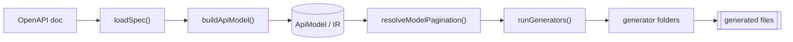

# Client Generator — Architecture

How `@redocly/client-generator` is built.
This is a **descriptive** map of the current shape — the pipeline, the folders, and the seams.
It says _what is_; the **why** (the significant decisions and their trade-offs) lives in the Architecture Decision Records under [`docs/adr/`](./docs/adr/), linked inline below.
For the vocabulary used here (IR, generator, printer, runtime, output mode, …), see [CONTEXT.md](./CONTEXT.md).

## Overview

The package turns an OpenAPI description into typed API clients — the TypeScript client plus the `python`, `go`, and `php` SDKs, the generated CLI, and satellite modules (`zod`, `mock`, `swr`, `tanstack-query`, `transformers`) — with **zero runtime dependencies** in the generated code ([ADR-0002](./docs/adr/0002-typescript-peer-dep.md)).
It backs the `redocly generate-client` and `redocly eject-generator` CLI commands.

## Codegen approach

Generated code is **text**, written with a small structural `Printer` (indentation, blocks, blank-line discipline) and one **syntax printer per output language** that owns naming, string escaping, literals, and comments ([ADR-0021](./docs/adr/0021-text-printers.md); this superseded the original AST approach of [ADR-0001](./docs/adr/0001-ast-codegen.md) — `typescript` is no longer loaded on the generation path).
The **runtimes** are not generated at all: each is hand-written source in its generator's `runtime/` folder, embedded or copied verbatim ([ADR-0017](./docs/adr/0017-runtime-module-and-descriptor-client.md), [ADR-0022](./docs/adr/0022-runtime-inline-or-module.md)).

## Pipeline

```mermaid
flowchart LR
  spec[OpenAPI doc] --> load["loadSpec()"]
  load --> build["buildApiModel()"]
  build --> ir[("ApiModel / IR")]
  ir --> resolve["resolveModelPagination()"]
  resolve --> run["runGenerators()"]
  run --> gen["generator folders"]
  gen --> files[["generated files"]]
```

1. **`loadSpec`** (`loader.ts`) — bundles the OpenAPI document via `@redocly/openapi-core`, resolving external `$ref`s while preserving internal ones, and detects the spec version.
   Swagger 2.0 is converted to the 3.x shape by `intermediate-representation/normalize-swagger2.ts` first.
2. **`buildApiModel`** (`intermediate-representation/build.ts`) — walks the document and produces the spec-agnostic **IR** (`intermediate-representation/model.ts`).
   Everything downstream reads the IR, never the raw spec ([ADR-0003](./docs/adr/0003-spec-agnostic-ir.md)).
   Facts every generator would otherwise re-derive are computed once here — for example `op.sse` (the streaming facts of a `text/event-stream` operation).
   `intermediate-representation/sanitize-identifiers.ts` renames spec names that collide with generated-module identifiers (the reserved set in `reserved-names.ts` spans every target language, so one schema keeps one name across SDKs).
3. **`pipeline.ts`** — resolves pagination ONCE for the run (`pagination.ts`: per-operation config > `x-redoclyPagination` > convention, statically fit-verified, one aggregated error; [ADR-0018](./docs/adr/0018-auto-pagination.md)), parses the `--output` anchor, and calls `runGenerators`.
   Each selected generator receives one `GeneratorInput`: the IR, the parsed `output` anchor, the `banner` lines, the emit options, and the resolved pagination map.
   Every emitted path is contained under the output directory — a generator (ours or a user's) cannot write outside it.
4. **The generators** (`generators/<name>/`) render their files; `pipeline.ts` writes them to disk.

## Generator folders

Every generator is a self-contained folder ([ADR-0020](./docs/adr/0020-self-contained-generator-folders.md)): `AGENTS.md` (its design, shipped to users as an agent skill), `index.ts` (the entry: `run`/`sample`/`docs`/`options`), and one file per pipeline stage — `naming`, `types`, `models`, `descriptor`, `operations`, `pagination`, `client` — plus `runtime/` where the generator embeds one.
The skeleton is descriptive, not prescriptive: a generator omits a stage it does not have, and the small satellites keep one `render.ts`.
An agent that has read `generators/python/` can navigate `generators/typescript/` without re-learning.

Sharing has four tiers, and only four — each folder imports its own package by the SAME specifiers an ejected copy uses (a tsconfig `paths` entry resolves them to `src/` in this repo):

1. **The neutral toolkit** — `@redocly/client-generator`: the IR types, the schema/naming/operation helpers under `authoring/`, the structural `Printer`, and the generator contract types.
2. **Its own language printer** — `@redocly/client-generator/printers/<language>` (`printers/*.ts`): syntax mechanics with exactly one right answer per language.
   Never another language's printer.
3. **The runtime sources** — `@redocly/client-generator/runtime-sources`: prepare-time snapshots (`runtime-sources/*.ts`, generated by `scripts/generate-runtime-sources.mjs`) of each runtime's real sources, for the generators that embed one.
4. **A required generator's published contract** — `@redocly/client-generator/contracts/typescript` (`contracts/typescript.ts`): the generated SDK's ABI (`operationSignature`, `variablesName`, `sdkCallText`, `wrappableOperations`, `flatInputShape`), imported only along a declared `requires` edge (`swr`, `tanstack-query`, `cli`).

No relative import may leave a folder; `generators/__tests__/language-dogfooding.test.ts` enforces the tiers for all ten generators.

## Contracts at package level

Types that both the pipeline and a runtime must agree on are defined once, at package level, and the runtime imports them: `runtime-contract.ts` (the `--setup` surface — `ClientSetup`, `Middleware`, `RetryConfig`, … — plus `PaginationSpec` beside its resolver in `pagination.ts`) and `cli-contract.ts` (the composed-CLI authoring types).
Because embedded runtime modules must stay self-contained, `scripts/generate-runtime-sources.mjs` splices the contract definitions back into the snapshot text verbatim at prepare time — one definition in the tree, byte-identical embedded output.

## Runtime modes

`runtime: 'inline'` (default) embeds the runtime into the generated file — only the modules the API needs, assembled by `generators/typescript/inline-runtime.ts` (and each language generator's own stitching) from the stripped snapshots.
`runtime: 'module'` writes the same sources as real files in a `runtime/` folder beside the generated client, which imports them relatively — deduplication without a package dependency ([ADR-0022](./docs/adr/0022-runtime-inline-or-module.md); the former `package` mode is removed, and the package root exports only the authoring surface).

## Eject

`redocly eject-generator <name>` copies the generator's source folder into the user's repo as TypeScript, with a provenance header per file and the descriptor default export appended to `index.ts` — no bundling, no import rewriting (`scripts/generate-eject-assets.mjs` builds the assets at prepare time).
`--update` three-way-merges a newer built-in version into the user's copy per file, fetching the merge base from the version the header records.
Running a `.ts` generator uses Node's type stripping; the resolver (`generators/resolve.ts`) checks the floor (Node ≥ 22.18 / 23.6) at the point of use.
The generator's `AGENTS.md` ships alongside as `.claude/skills/<name>-generator/SKILL.md` (`scripts/ejected-skill.mjs`).

## Config

`redocly.yaml` carries the same options as the flags under the `client` block (top-level `client` → per-API `client` → flags); the schema lives in `packages/core`'s `redocly-yaml.ts`.
See [ADR-0008](./docs/adr/0008-redocly-yaml-config.md) and [ADR-0019](./docs/adr/0019-first-class-client-config.md).

## What varies

- **Output mode** (`--output-mode`): `single` · `split` — file layout.
- **Runtime** (`--runtime`): `inline` · `module` — where the client engine lives.
- **Args style** (`--args-style`): `flat` · `grouped` — how a call spells its inputs.
- **Error mode** (`--error-mode`): `throw` · `result`; **date type** (`--date-type`): `string` · `Date`; plus `--server-url` / `--setup` ([ADR-0015](./docs/adr/0015-publisher-setup-bake-in.md)).
- **`--generator`** selects which generators run (default `typescript`), with per-generator options validated against the schema each generator declares; custom generators load by path or `customGenerators` ([ADR-0012](./docs/adr/0012-plugin-api.md)).

## Test architecture

- **Unit tests** (`VITEST_SUITE=unit`) live in `__tests__/` beside their module.
  Rendering is covered by output-string assertions; the language suites additionally compile their output for real (`py_compile`, `go build`, `php -l`).
- **E2E tests** (`VITEST_SUITE=client-generators`, under `tests/e2e/generate-client/`) generate real clients, type-check them under strict `tsc`, run them against local mock servers, and pin the headline guarantee: an ejected-unmodified generator produces byte-identical output.
- **Guard tests** pin the architecture itself: `language-dogfooding.test.ts` (the import tiers), `pipeline-ts-free.test.ts` (the pipeline's static graph reaches no generator folder and no `typescript`), `runtime-embed-freshness.test.ts` and the `runtime-sources` suites (snapshots track the real sources; the contract splice is byte-exact), and `generator-skills.test.ts` (every generator ships a skill).

Compile (`npm run compile`) before running tests, and `npm run prepare -w @redocly/client-generator` after changing runtime sources or eject assets.

## How to add things

- **A new schema kind** — add the variant to `SchemaModel` (`intermediate-representation/model.ts`), produce it in `intermediate-representation/build.ts`, and cover it in each generator's `types` stage.
- **A new runtime capability** — add a module under `generators/typescript/runtime/`, thread it through the capabilities seam (`runtime/create-client.ts`), list it in `scripts/generate-runtime-sources.mjs`, and teach `inline-runtime.ts` when to embed it; then `npm run prepare` regenerates the snapshot.
- **A new wrapper generator** — reuse `@redocly/client-generator/contracts/typescript` for operation eligibility and the calling convention, declare its contract (`requires`/`errorModes`/`dateTypes`) in `generators/meta.ts`, and give it a folder with an `AGENTS.md` design skill (a guard test enforces this).
  See [ADR-0011](./docs/adr/0011-wrapper-generators.md).
- **A new language generator** — a folder authored ONLY with the neutral toolkit and its own printer, following the stage skeleton; the dogfooding guard holds it to the same tiers users' generators get.
- **A custom generator (plugin, experimental)** — author `{ name, run }` with `defineGenerator` from the package root; no core change is needed — `generators/resolve.ts` loads and validates it.
  See [ADR-0012](./docs/adr/0012-plugin-api.md).

## Keep this current

Update this file when the **pipeline** stages, the **seams**, or the **folder layout** change — not for routine feature work within an existing folder.
Keep it **descriptive**.
When you make a significant, hard-to-reverse decision, record it as a new ADR in [`docs/adr/`](./docs/adr/) (don't rewrite an existing ADR — supersede it), and link the relevant seam here to it.
